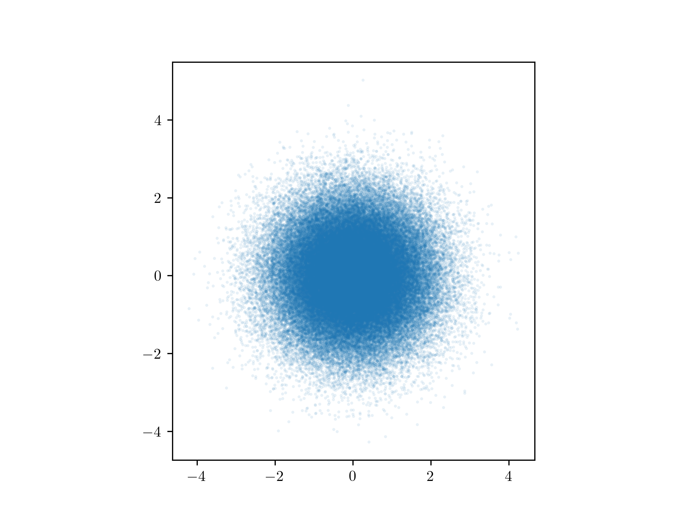

With the rise of "big data," it's become common for figures in journal articles to show several hundred or more points on a single graph. This, and the statistical insights that originate from such figures, are great. But what is not so great is when you try to read a paper containing one of these plots and your PDF reader hangs as it struggles to render every facet of your beautiful, vectorized plot.

I myself am [guilty of this](https://ui.adsabs.harvard.edu/abs/2017ApJ...851..132C/abstract).

If you are using Matplotlib to plot many dense plots (in astronomy this includes high resolution spectra, exoplanet discoveries, MCMC traces, and more) consider using the `rasterized` [keyword option](https://matplotlib.org/api/_as_gen/matplotlib.artist.Artist.set_rasterized.html#matplotlib.artist.Artist.set_rasterized) to prepare your figures and significantly reduce the workload for the PDF readers of your future audience. (Note that if you *aren't* making dense plots, or are already producing rasterized plots (like with `imshow`), the following suggestions won't help you much).

To rasterize large collections of points/lines, simply include `rasterized=True` to your `plot` commands. You'll also likely want to include a `dpi=600` option to your `savefig` command (or change this in your `matplotlibrc`), since the default values are usually so low as to result in pixelated plots. Here is a script to create both a default (fully vectorized) version and a rasterized version:


import matplotlib.pyplot as plt
import numpy as np

n = 100000
x = np.random.normal(size=n)
y = np.random.normal(size=n)

pkw = {"marker": "o", "alpha": 0.1, "mew": 0, "ms": 2, "ls": ""}

fig, ax = plt.subplots(nrows=1)
ax.plot(x, y, **pkw)
ax.set_aspect("equal")
plt.savefig("scatter.pdf")

fig, ax = plt.subplots(nrows=1)
ax.plot(x, y, "o", **pkw, rasterized=True)
ax.set_aspect("equal")
plt.savefig("scatter-rasterized.pdf", dpi=600)


While the rasterized option does reduce the filesize (compare 0.8 Mb to the fully vectorized version at 1.5Mb), the main benefit is how quickly your PDF reader will render this figure when it is viewed in a publication. I created sample RNAAS documents using the two different versions, available here:

* [Fully Vectorized](fully_vectorized.pdf)
* [Partially Rasterized](rasterized.pdf)

Try timing how long your PDF takes to render them. I noticed the fully vectorized version took at least a few seconds to render on my laptop, while the rasterized version displayed instantaneously. If your paper is composed of several of these kinds of plots, that load time will add up and distract your reader from all the wonderful science you've done!

The figure axes, tick labels, etc, are still vectorized, so they will look decent when zoomed. But the dense point cloud has been rasterized, meaning it is stored as an image rather than with the vectorized instructions on how to draw every single point. There's obviously a turnover point in plot complexity when this option becomes useful. You wouldn't want to make every simple line plot with the `rasterized=True` option, but somewhere north of a few thousand points is where it really starts to help. The best way to monitor this is to check whether your PDF loads snappily or not. Your reader will be much more likely to continue scrolling through your paper if everything goes smoothly vs. if their PDF reader hangs as it loads every last point cloud. If you do really want to provide every last detail about the data to your audience, the best venue is to provide the actual data values that were used to make a plot via a machine readable file.

Thinking about figure file size now will also pay dividends to your future self. Many applications (postdoc, faculty, grants, etc...) will require a sample of your published work. Most application servers place a limit on the upload file size. 15Mb is typical, but I have seen some applications with limits as low as 2Mb. If you can configure your manuscript filesize so that it is only as large as it needs to be, you'll avoid the problem of having to remake your figures and manuscripts later to satisfy strict upload limits.